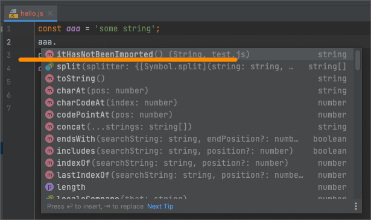
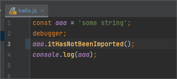
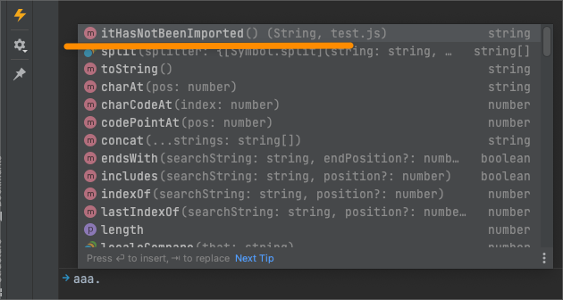
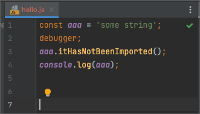
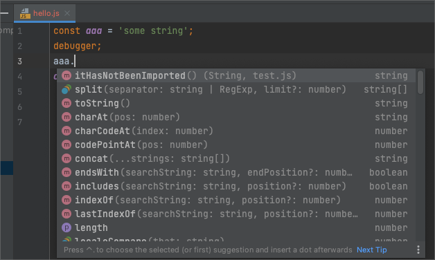
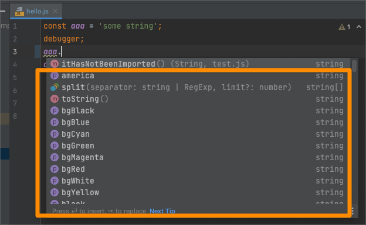
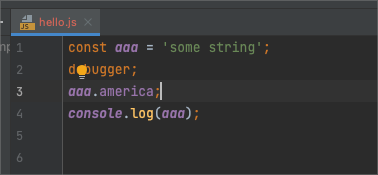
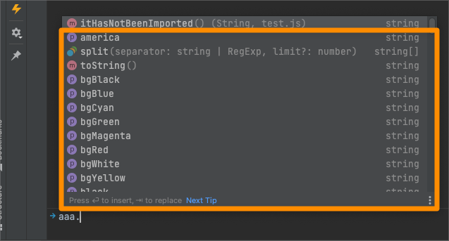
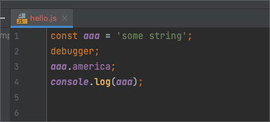

# This is simple example how IntelliJ Editor and Debugger console context works with code autocomplete (suggestions)

[IntelliJ Bug issue](https://intellij-support.jetbrains.com/hc/en-us/community/posts/5101885176210--BUG-Debugger-console-doesn-t-auto-complete-on-macOS-12-3-and-IntelliJ-IDEA-2022-1-)


### Case 1: not imported module
- Got to file 'hello.js'
- On the line number 3 (after `debugger` line) start to type: `aaa.`
- You will see autosuggestion `iiHasNotBeenImported`



- You can apply and will not see any error or trying to import it from `test.js`



- The code running will be failed.
- Run debugger, the code will stop on the line 2 (debugger).
- Go to Debugger Console and try to type `aaa.`.
- You will see again `iiHasNotBeenImported`



**Questions:** 
- Why `iiHasNotBeenImported` there?
- Why in the editor this suggestion appears if it was not imported? 
- Ok, if it was applied - then it must be imported automatically or IntelliJ must highlight the error, but it is looks fine:



- Why this suggestion appear in the Debugger console during run time if it has not been imported? It will not work anyway!


## Case 2: Not imported package
- Go to `hello.js`
- Start typing on the last string `aaa.`
- You will same as before (from previous example):

- 

- Now install packages:

```shell
yarn install --frozen-lockfile
```

- On the line number 3 (after `debugger` line) start to type: `aaa.`
- You will see autosuggestion from installed package: 


 
- Again no errors or automatic import if suggestion was applied:



- Run `hello.js` in the Debug mode with IntelliJ IDE
- Make sure that code was sopped on the line with 'debugger'
- Got to Debugger console
- Start typing 'aaa.'
- Pay attention on the showed menu with autocompletion suggestions again (america and so on):




**Questions:**
- Why suggestions are there (america and so on)?
- Why in the editor this suggestion appears if it was not imported?
- Ok, if it was applied - then it must be imported automatically or IntelliJ must highlight the error, but it is looks fine:



- Why this suggestion appear in the Debugger console during run time if it has not been imported? It will not work anyway!

